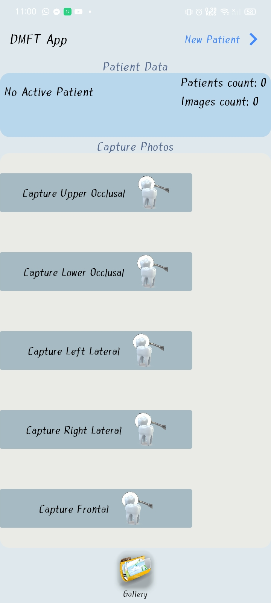
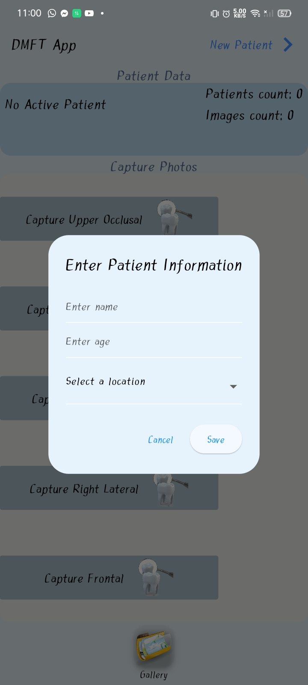
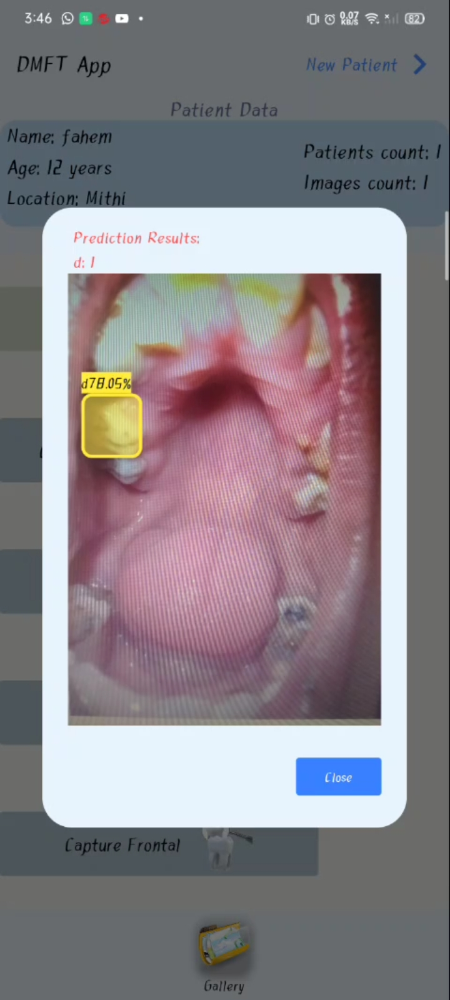

# IntraOral Decay Detection App

This Flutter application utilizes the Flutter PyTorch library along with YOLOv5 models for detecting decayed teeth in intraoral images. It provides functionality to capture five different views of the teeth and determines the presence of decay as well as the number of decayed teeth.

## Getting Started

This project is based on a flutter App that is capable of detecting disease in human tooth like decayed tooth..

A few resources to get you started if this is your first Flutter project:

- [Lab: Write your first Flutter app](https://docs.flutter.dev/get-started/codelab)
- [Cookbook: Useful Flutter samples](https://docs.flutter.dev/cookbook)

For help getting started with Flutter development, view the
[online documentation](https://docs.flutter.dev/), which offers tutorials,
samples, guidance on mobile development, and a full API reference.

## Features

- Capture five different views of intraoral images:
  1. Upper Oclusal
  2. Lower Oclusal
  3. Right Lateral
  4. Left Lateral
  5. Frontal

- Utilizes YOLOv5 models for decay detection.
- Provides real-time feedback on the presence of decay and the number of decayed teeth.
- Offers a user-friendly interface for easy interaction.

## Installation

1. Clone the repository:
```bash
git clone https://github.com/MeDenTec/Tooth-decay-detection-App.git
```

2. Navigate to the project directory:

3. Install dependencies:
```bash
flutter pub get
```

## Demo





## Video Demo

[Watch the demo video](demo\dmft_demo)

## Usage

### Flutter Run
1. Ensure that you have a device connected or an emulator running.
2. Run the application:
```bash
flutter run
```
3. Use the following credentials to login the App
```python
UserName => 'admin'
Password => 'password'
```
4. Capture intraoral images from different views using the provided interface and get the detection results.
5. Here, label 'D' represents the Secondary decay and and label 'd' represents the Primary decay.

### Built apk
You can also download and install suitable apk version for your android device from the Built apk folder
``` Python
 Built apk\app-arm64-v8a-release.apk
 Built apk\app-armeabi-v7a-release.apk
 Built apk\app-x86_64-release.apk
 ```


## Cutomization
### 1. YOLOv5 model training

You can train your own model on custom dataset using this YOLOv5 Colab Notebook

<a href="https://colab.research.google.com/github/ultralytics/yolov5/blob/master/tutorial.ipynb"></a>

### 2. Model Conversion & Optimization

Convert your model to torchscript format to run on smartphones.

```bash
!python export.py --weights "the weights of your model" --include torchscript --img 640 --optimize
```

### 3. Save models and labels

Save the best.torchscript and labels.txt files in the following directory. Remember to replace your label names in labels.txt file and update number of classes in loadModel() function homeScreen.dart.

```bash
assets:
- assets/models/best.torchscript
- assets/labels.txt
```

```dart
  Future loadModel() async {
    String pathObjectDetectionModel = "assets/models/best.torchscript";
    try {
      _objectModel = await FlutterPytorch.loadObjectDetectionModel(
          // change the 2 with number of classes in your model I had almost 2 classes so I added 2 here.
          pathObjectDetectionModel,
          2, // Number of Classes
          640, // Image width
          640, // Image Height
          labelPath: "assets/labels/labels.txt");
    } catch (e) {
      if (e is PlatformException) {
        print("only supported for android, Error is $e");
      } else {
        print("Error is $e");
      }
    }
  }
  ```